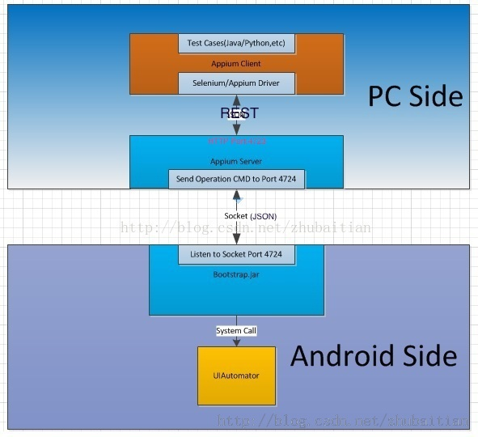

## 简介

Brush是一个框架目标是在android手机上运行脚本程序实现模拟用户操作。

## 项目目录

    root
    |__doc  # 项目文档
    |__master  # 设备管理服务器(未完成)
    |  |__node # nodejs版本
    |  |__py   # python版本
    |
    |__slave  # qpython脚本
       |__scripts  # 执行任务的脚本
       |  |__appium4droid  # appium驱动
       |  |__deprecated  # 历史脚本, 弃置不用
       |  |__machines  # Machine组件
       |  |__mrz  # 每日赚相关脚本
       |  |__ttz  # 天天赚相关脚本
       |  |____app_tasks.json  # 渠道任务配置文件
       |  |____AppiumBootstrap.jar  # appium框架的bootstrap包
       |  |____bootstrap.py  #
       |  |____scheduler.py
       |  |____util.py
       |  |____ ....
       |
       |
       |
       |__libs # 依赖库, 请将里面的文件全部放在手机 /sdcard/com.hipipal.qpyplus/lib/python3.2/site-packages/里
       |__res  # 资源文件
       |__test
       |__tools
       |____device.txt  # 设备标志文件, 保存设备号等信息, 需存放在手机sd卡根目录
       |____main.py  # 对应python服务器的客户端
       |____main2.py  # 对应nodejs服务器的客户端
       |____config.json  # main.py的配置
       |____config2.json  # main2.py的配置
       |_____ ..... # 其他文件

## 原理
Brush对于android手机的ui操作基于appium在android平台下的bootstrap组件。
  
Bootstrap.jar在android手机中启动了一个socket server监听4724端口，接收指令然后通过android的UIautomator测试框架获取手机的UI元素和执行相应的触控操作。

appium测试脚本运行时Appium Driver连接上Appium Server，将脚本的函数调用转换为相应的命令发送给Appium Server。Appium Server连接客户端时将在android设备上启动AppiumBootstrap.jar，然后将收到的指令转换换成Bootstrap的指令并发送给手机的4724端口。

Brush/slave/bootstrap.py中的setup_bootstrap函数可以在qpython中启动AppiumBootstrap.jar(需要root权限)，  scripts下的appium4droid实现了webdriver到bootstrap协议的直接转换，支持常用的webdriver API。实现的协议可见 appium4droid/webdriver/handler.py  

其他详细情况：# TODO

## 需求
* Android系统4.3以上(4.3以上系统才有UIautomator)
* ROOT权限
* 手机安装qpython3，脚本运行在python3上

## 安装使用
将Brush/slave复制到手机SD卡根目录的com.hipipal.qpyplus/scripts3/下(第一次启动qpython时会创建这个文件夹)

脚本文件放入slave/scripts目录下

打开qpython3，点击［程序］->［脚本], 选择slave/scripts下的脚本文件点击后点选［运行］

 
## 脚本撰写
### Quikc Start

    import time
    from appium4droid import webdriver
    
    dr = webdriver.Remote()
    dr.press_keycode(3)
    time.sleep(1)
    setting = dr.find_element_by_name("设置")
    setting.click()
    
### 目前支持的API
实现了的指令能在appium4droid/webdriver/command_execut.py下看到

如果调用不支持的api，会抛出NotImplementedError。

更多内容参考[Appium文档](https://testerhome.com/topics/3144)   
### snippets
#### 一些操作

	dr.press_keycode(keycode)  # 按下按键
    dr.tap(320, 640)  # 点击坐标
    dr.swipe(x1, y1, x2, y2)  从(x1, y1)划到(x2, y2)
    

keycode可参考[文档](http://developer.android.com/intl/zh-cn/reference/android/view/KeyEvent.html)
#### 等待某元素出现

	from appium4droid.common.exceptions import *
	from appium4droid.support.ui import WebDriverWait

	try:
 		#	                __等待时间，以秒计
	    #                  | 
	    WebDriverWait(dr, 30).until(lambda d: d.find_element_by_name(some_text_in_element))
	except TimeoutException:  # 等待超时抛出TimeoutException
		print("timeout")
		# do somethin else
#### 等待某元素消失用		

    try:
	    WebDriverWait(dr, WAIT_TIME).until_not(lambda d: d.find_element_by_name(some_text_in_element))
	except TimeoutException:  # 等待超时抛出TimeoutException
		print("timeout")
		# do somethin else
		
#### XPath 

	# 寻找android.webkit.WebView下的第一个android.view.View
	view = dr.find_element_by_xpath("//android.webkit.WebView/android.view.View")
	# 寻找android.webkit.WebView下的所有android.view.View
	views = dr.find_elements_by_xpath("//android.webkit.WebView/android.view.View")

常用xpath

    # 寻找android.webkit.WebView下的第四个android.view.View
    xpath = "//android.webkit.WebView/android.view.View[3]"
    
    # 寻找android.view.View下的android.widget.TextView下的所有元素
    xpath = "//android.view.View/android.widget.TextView/*"
    
	# 寻找content-desc内容为somthing的android.view.View元素
	xpath = "//android.view.View[@content-desc='somthing']"
	
	# 寻找content-desc内容包含somthing的android.view.View元素
	xpath = "//android.view.View[contains(@content-desc, 'somthing')]"
	
	# 寻找package为com.miui.home的android.view.View元素
	xpath = //android.view.View[@package='com.miui.home']"
	
更多内容参考[XPath教程](http://www.w3school.com.cn/xpath/)

#### 获取UI元素的属性

    ele = dr.find_element_by_xpath(xpath)
    ele.text      # 元素的text
    ele.location  # 元素的位置,返回一个字典{'x': xxx, 'y': xxx}
    ele.size      # 元素的大小,返回一个字典{'height': xxx, 'width': xxx}
    ele.get_attribute(attr)  # 获取元素的某个属性
    ele.get_attribute(“name”)  # 获取元素的content-desc
    ele.get_attribute(“className”)  # 获取元素的类名
    
#### androidhelper库
androidhelper库是qpython提供的可以调用android应用api的一个库。通过androidhelper的api我们可以获取手机的信息和控制手机进行部分操作。

demo

    import androidhelper
    
    droid = androidhelper.Android()
    droid.makeToast("hello welcome to qpython")
一些例子，可以在scripts下的util.py看到

	import time
    import androidhelper
    
    droid = androidhelper.Android()
    
    def alert():
        droid.vibrate(8000)   # 手机震动8000毫秒
        droid.mediaPlay("/sdcard/com.hipipal.qpyplus/scripts3/res/killbill.mp3")  # 播放音乐
        time.sleep(30)
        droid.mediaPlayClose()
        
    def reset_wifi():
    	print("reset WiFi")
    	droid.toggleWifiState()   # 切换wifi状态
    	time.sleep(20)
    	droid.toggleWifiState()
    	time.sleep(20)

更多内容参考[androidhelper文档](http://kylelk.github.io/html-examples/androidhelper.html)

## Troubleshooting
## FAQ

